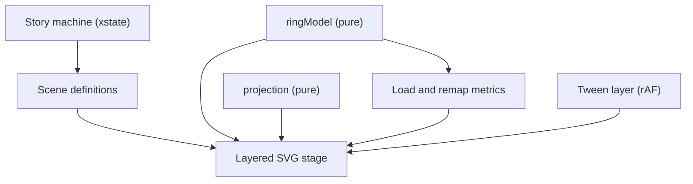

# Hash Ring Visual Design Plan

## Goal

The current demo asks one literal animation to explain behaviour that only becomes meaningful at large scale. A handful of vnodes cannot demonstrate even distribution, and a handful of particles cannot demonstrate load. The redesign accepts that no single view works at every scale, and instead moves the viewer through scales deliberately.

The core messages, in teaching order:

- A hash maps a key to a position in a fixed number range.
- That range wraps, which is why we draw it as a ring.
- A key belongs to the first server clockwise from its position.
- When a server leaves, only its keys move, but they all land on one neighbour.
- Virtual nodes fix that by giving every server many positions.
- At production scale you stop inspecting positions and start reading aggregates.

## Design Principle

Each scene picks one scale and is honest at that scale:

- **Literal** when there are few enough objects to inspect individually.
- **Zoomed** when detail is real but too dense to show across the whole ring.
- **Aggregate** when the only truthful full-scale statement is statistical.

The failure mode to avoid is an aggregate view that looks literal, for example colouring a ring bucket as though one server owns it when thousands of vnode boundaries cross it.

## Scene Breakdown

### Scene 0: Hash Space Is A Number Line

**Teaches:** hashing is positioning, and the space is just numbers.

A glowing horizontal rail runs from `0` to `2^32 - 1`. Sample keys (`user:1842`, `image:91`, `session:abc`) pass through a scanner beam and land as ticks at their hashed positions. Ticks are neutral coloured, with no server ownership yet.

> A hash function turns each key into a position in a fixed number range.

Advance on "Next" after two or three keys land. Hovering a key replays its landing.

**Style:** neon measuring rail, terminal-style decode on hash, monospace numerics with subtle glitch on settle.

### Scene 1: The Range Wraps Into A Ring

**Teaches:** the ring is not a new structure, it is the same line joined end to end.

The rail bends until its endpoints meet. The `0` and max labels converge on a single seam. Key ticks travel with the line and keep their relative spacing throughout.

> The ring is the same number range, wrapped so the end connects back to the start.

This is the highest-value moment in the story, so it needs an obvious replay control.

**Style:** wireframe projection forming in space, seam pulse on join, radial grid resolving in as the circle closes.

### Scene 2: A Key Routes Clockwise

**Teaches:** the lookup rule, in isolation, before any complexity.

Three servers sit on the ring. A key lands, and a particle travels clockwise to the first server it meets. That server's ownership arc lights up behind it.

> A key belongs to the first server clockwise from its hash position.

The viewer steps through two or three keys. The ring stays sparse and literal.

**Style:** luminous particle trail, destination bloom on arrival, ownership arc lighting up like a circuit path.

### Scene 3: A Server Leaves

**Teaches:** both halves of the argument: what consistent hashing gets right, and what still hurts with one position per server.

Still three servers, one position each. Remove one. Two things happen in sequence:

1. Only the keys owned by the departing server move. Everything else stays put and can visibly lock in place. This is the payoff the name promises.
2. But every one of those keys lands on the same neighbour, whose arc now spans roughly twice what it did. Its load bar spikes.

> Only the failed server's keys moved. But one neighbour absorbed all of them.

This ordering matters. It motivates virtual nodes with a deterministic, reproducible outcome rather than relying on a hash seed that happens to look lopsided. Uneven initial placement is worth a supporting line, but it should not carry the argument, because with a different seed three servers can look perfectly reasonable.

**Style:** departing server destabilises and drops out, stable arcs get a dimmed shield treatment, the absorbing neighbour pulses a warning colour as its meter climbs.

### Scene 4: Virtual Nodes Spread The Load

**Teaches:** why one server needs many positions.

Each server splits into several smaller markers around the ring, inheriting its colour. Physical servers stay listed outside the ring so repeated colours read as one machine. Then replay the same removal from Scene 3: this time the departing server's ranges are scattered, and its load is absorbed by several neighbours in smaller pieces.

> With many positions per server, a failure spreads across many neighbours instead of falling on one.

A stepper toggles 1, 3, and 8 vnodes per server. All three counts stay individually inspectable.

**Style:** server cards projecting echo markers onto the ring, faint tether lines during the split that fade once placed, micro-dot markers rather than full circles.

### Scene 5: Zoom Into Production Density

**Teaches:** real systems use far more positions than we can draw.

The full ring recedes and a narrow arc is magnified into a scanner viewport. Inside, dozens of alternating boundaries are visible and clearly too fine to have been legible on the full ring.

> At practical scale the boundaries are real, but far too dense to read around the whole ring.

The viewer can scrub the zoom window around the ring. Optional for the first pass if the transition proves fiddly.

**Style:** glowing calipers bracketing the sampled arc, dense circuit-trace boundaries inside the viewport.

### Scene 6: The Full-Scale View

**Teaches:** what to read when individual positions stop being readable.

This is the scene most likely to fail, and the one the previous implementation got wrong. At high vnode counts there is no dominant owner in a visual slice, so any per-slice ownership colour is a lie. The plan does not yet commit to a treatment. Candidates:

- **6A - Per-server concentric lanes.** Each server gets its own thin ring. Its vnode ranges are drawn as segments within that lane. At high counts each lane reads as a dashed band circling the whole ring, which states the truth directly: every server is everywhere, and total ink per lane is its share. Strong candidate.
- **6B - Stacked bucket density.** Divide the ring into fixed buckets; within each, a small radial stack shows what proportion each server owns. Truthful and information-dense, but risks reading as muddy colour blend.
- **6C - Linearised strip.** Unroll the ring into a horizontal strip beneath it, with ownership as fine stripes. Echoes Scene 0, so the viewer already has the mental model, and slivers stay perceptible at densities where arcs would not. Strong candidate.
- **6D - Heat only.** Ring shows traffic intensity as glow, with ownership relegated entirely to side load bars. Safest but weakest.
- **6E - Explicit sampling.** Draw a systematic sample of positions labelled "showing 200 of 6,000". Honest, but admits the visual is decorative.

Prototype **6A** and **6C** before committing.

There is also a framing risk here. If Scene 5 says the ring is too dense to read and Scene 6 replaces it with a summary, the viewer may conclude the ring has stopped earning its place. The answer is that remapping is inherently spatial, so the ring justifies itself in Scene 7, which argues for keeping 6 and 7 tightly coupled rather than treating them as separate beats.

### Scene 7: Topology Change At Scale

**Teaches:** the practical payoff, measured rather than asserted.

Add a server. Its new positions claim slivers scattered around the ring; everything else holds. A metric states the remapped fraction, and load bars settle to a new balance.

Note the same density problem applies: adding a server with many vnodes produces many tiny stolen arcs. Whichever treatment wins in Scene 6 has to carry the highlight here too, which is a good reason to prototype them together.

> Adding a server only remaps the ranges it takes over.

**Style:** high-contrast outlines or electric arcs on remapped ranges, shield treatment on stable ranges, new server dropping in like a node joining a network.

### Scene 8: Sandbox

**Teaches:** nothing; it lets the viewer play once the model is established.

Defaults to the full-scale view, with toggles for vnode ticks, zoom detail, sample request traces, and remap overlay. Servers and vnode counts become freely adjustable, and the tutorial can be replayed from any scene.

**Style:** operator console. Scene labels read as system modules: `HASH_SPACE`, `LOOKUP`, `FAILOVER`, `VNODE_DENSITY`, `REMAP`.

## Navigation And Re-entry

A guided tutorial is hostile on a second visit if it cannot be skipped:

- Persistent "skip to sandbox" control.
- Scenes addressable by URL so a specific moment can be linked or reloaded.
- Back/forward between scenes, not just forward.
- Remember on return visits that the tutorial has been seen, and open in sandbox by default.

## Technical Approach

### Rendering: stay on SVG

SVG remains the right choice, and the reason is the design itself. Element counts only explode if the full-scale view draws every vnode, which the plan explicitly rejects. An aggregated view is a few hundred paths at most, which SVG handles comfortably, while keeping crisp text, easy hit-testing, Tailwind-driven styling, and the existing glow filters.

The one place this could break is if Scene 6 wants a dense decorative texture of thousands of faint ticks. Escape hatches, in order of preference: an SVG `<pattern>` fill, a pre-rendered canvas layer sitting behind the SVG, or capping the drawn sample. Reach for these only if a chosen treatment demands it. Do not pre-emptively move to canvas or WebGL.

### The line-to-ring morph: parametric projection, not path interpolation

The Scene 1 transformation should not be a path-morphing problem. Instead every element positions itself through one shared projection function taking the bend amount as a parameter:

- At `t = 0`, position maps to a point along a straight rail.
- At `t = 1`, position maps to a point on the circle.
- In between, the rail is an arc of fixed length `L` subtending angle `theta = t * 2pi`, so radius `r = L / theta`. As `theta` approaches zero the radius grows without bound and the arc flattens into the line.

Ticks, labels, servers and particles all consume the same projection, so the entire scene bends coherently and the animation reduces to tweening a single scalar. This also means Scene 0 and the linearised strip option in Scene 6 are the same code at `t = 0`.

### State: xstate for scenes, a separate layer for tweens

Scene progression maps naturally onto the existing xstate investment: scenes as states, `NEXT`/`BACK`/`REPLAY` as events, sub-beats as nested states, entry actions to arm transitions.

What should not go through xstate is per-frame animation. The current app sends a `TICK` event every frame and assigns to machine context, which means a machine transition and React render per frame. For the story, continuous values are almost entirely scalar tweens, so:

- xstate owns discrete state: current scene, current beat, playing or paused.
- A thin animation layer owns continuous values and ideally updates SVG attributes without re-rendering React each frame.

For that layer, either a small hand-rolled rAF tween hook, which fits the project's existing preference for owning its own state, or Motion's `useMotionValue`/`animate`, which gives interruptible springs and out-of-render updates for free. Hand-rolling is maybe thirty lines until easing, interruption and chaining are needed, at which point the library earns its place.

### Module shape

Keeping geometry and model logic pure is what makes this tractable and testable:

- `ringModel` - build positions, resolve owner for a key, compute ownership ranges, load distribution, and the remap delta between two topologies. No React, no SVG.
- `projection` - position and bend amount to coordinates, arc path generation, bucket aggregation for the full-scale view.
- Stage layers - hash space, ring scaffold, servers, ownership, vnodes, traffic, remap, narration. Scenes declare which layers are active rather than each scene owning bespoke rendering.

Both pure modules are straightforward jest targets, which matters most for the remap delta, since "only this fraction moved" is the plan's central claim and should be asserted rather than eyeballed.

### Build the PoC in Storybook

Storybook is already configured, and the babel JSX preset was fixed earlier in this branch. Each scene as a story is a better PoC harness than a standalone page: scenes render in isolation, visual variants sit side by side, and Scene 6's competing treatments can be compared directly without wiring any app state.

### Incidental cleanup

`useHashRingSegments` imports the entire `d3` barrel for a single `d3.arc()` call. Switching to `d3-shape`, plus `d3-interpolate` and `d3-ease` if the tween layer wants them, will cut meaningfully into the current 500 kB bundle warning.

## Relationship To The Existing App

This is closer to a new application than a refactor, and that should be stated plainly given how much this branch has already been reworked. Roughly:

- **Reusable:** theme system, geometry helpers, `particleMachine` for sample traces, load-bar presentation, Storybook and jest setup.
- **Repurposed:** the existing freeform demo becomes Scene 8 rather than the entry point.
- **Likely obsolete:** the cycle-based orchestration between `simulationMachine`, `useNodes` and `AppContext`. Pending topology changes exist because continuous traffic must not be disrupted mid-flight; in a scene-driven story, topology changes are the authored moment, so that machinery only remains relevant inside sandbox mode.

Deciding this before building avoids maintaining two competing orchestration models.

## PoC Plan

Build in risk order, not story order. Scenes 0-2 are charming and low-risk; they will work. Scene 6 is where the previous approach died, and it is still the least specified part of this plan.

1. **Scene 6 treatments 6A and 6C**, at a realistic vnode count, with static data. Does either read as balanced, honest, and legible?
2. **Scene 7 remap highlight** on the winning treatment. Are the stolen slivers perceptible?
3. **Scene 3 removal at one position per server.** Does the single-neighbour spike land as clearly as expected?
4. **Scene 1 line-to-ring morph** via the parametric projection.
5. Remaining scenes, once the above hold up.

Stop after step 2 if neither treatment convinces. That failure is cheap here and expensive later.

### Success criteria

- The full-scale view reads as summarised, not as a literal drawing of every position.
- Removing a server without vnodes visibly overloads one neighbour.
- Adding a server visibly moves only a small fraction of the space.
- The ring reads as a wrapped number range rather than an arbitrary circle.
- Metrics feel like corroboration of what was just seen, not free-floating numbers.

Worth showing steps 1-3 to two or three people who do not already know consistent hashing. The criteria above are judgement calls, and the author is the worst possible judge of whether an explanation is clear.

## Open Questions

- Which Scene 6 treatment survives prototyping, and does it carry the Scene 7 highlight too?
- Is a naive-modulo comparison mode worth including, or does it dilute a demo that is already long?
- Should sample request traffic run continuously in sandbox, or only on demand when explaining a specific key?
